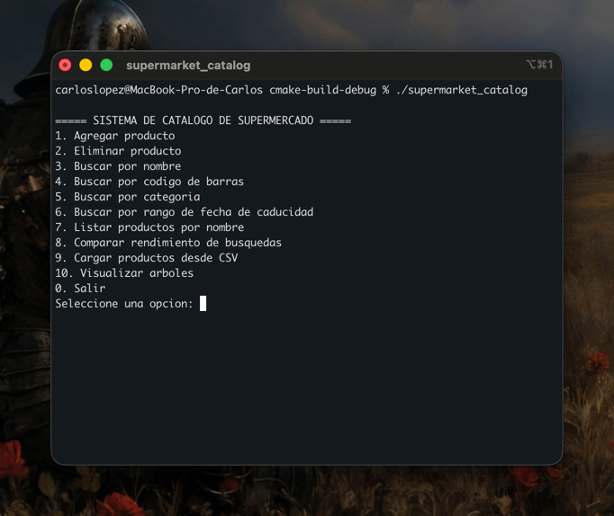
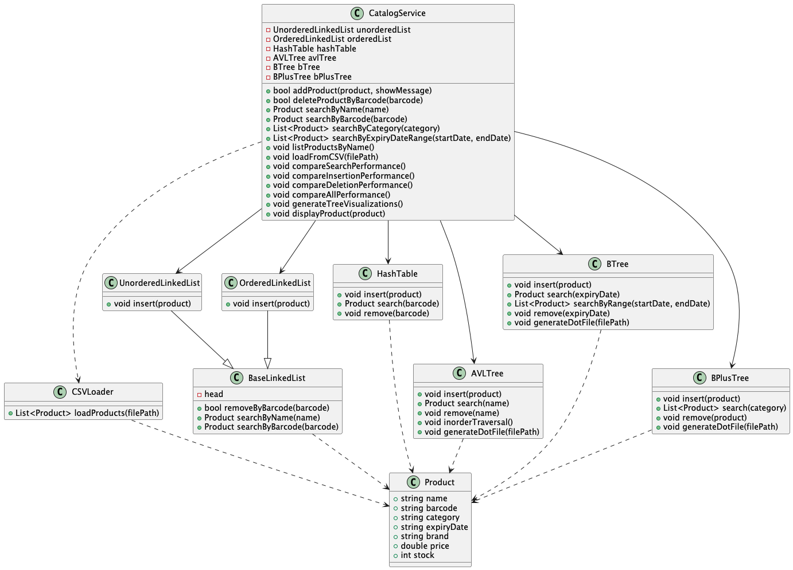
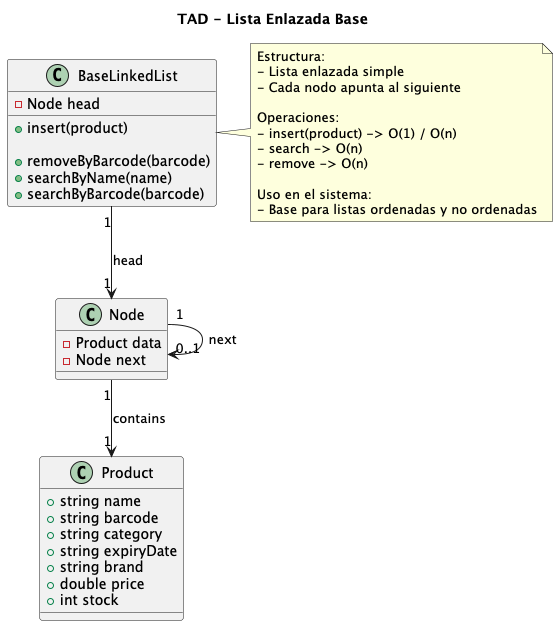
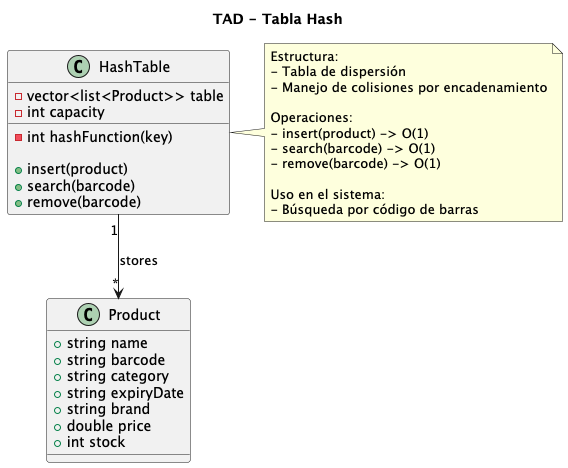
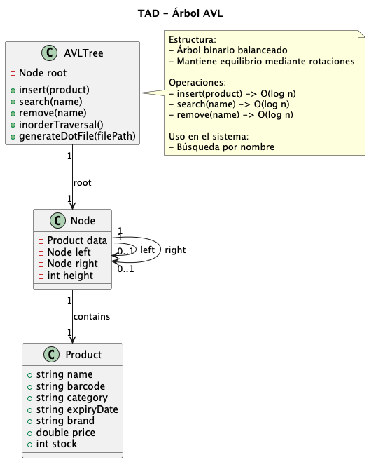
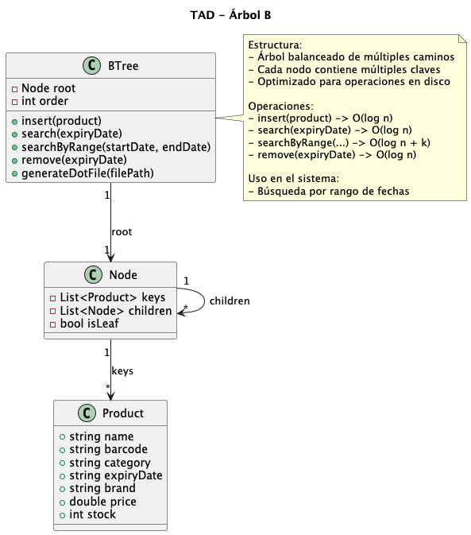
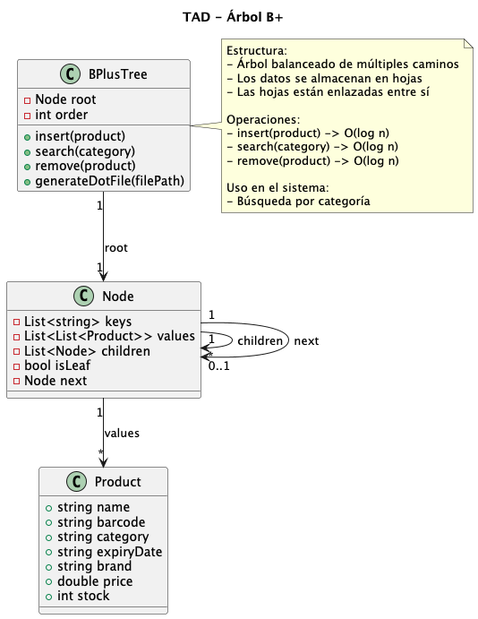
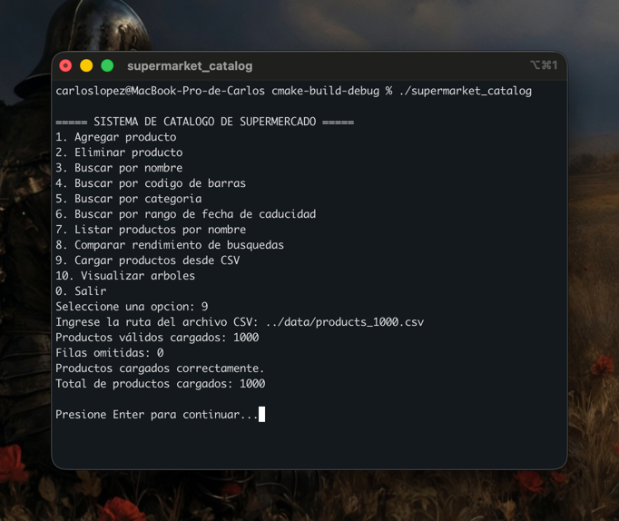
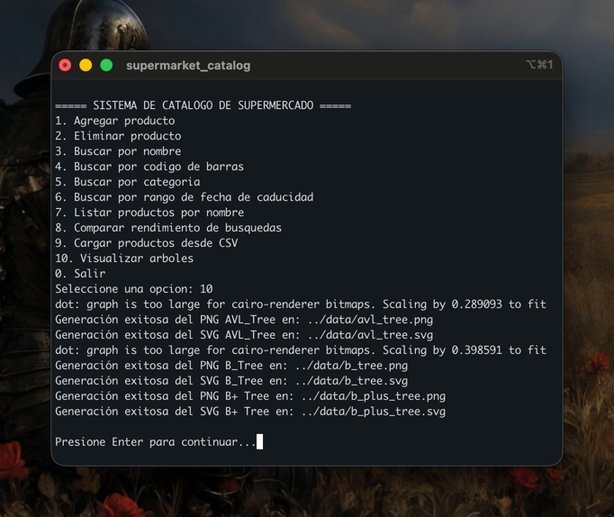
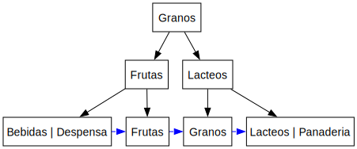

# Supermarket Catalog System - Reporte Técnico

## 1. Introducción

Este proyecto implementa un sistema de gestión de productos de supermercado utilizando estructuras de datos desarrolladas desde cero en C++. El objetivo principal es analizar y comparar diferentes estructuras para optimizar operaciones como inserción, búsqueda y eliminación.

---

## 2. Objetivos

### Objetivo general
Desarrollar un sistema eficiente de gestión de productos utilizando múltiples estructuras de datos.

### Objetivos específicos
- Implementar estructuras de datos desde cero
- Optimizar búsquedas según el tipo de consulta
- Garantizar consistencia entre estructuras
- Analizar complejidad temporal (Big-O)

---

## 3. Diseño del sistema

El sistema mantiene múltiples estructuras en paralelo. Cada vez que se inserta o elimina un producto, se actualizan todas las estructuras para mantener coherencia.

### Flujo general:

1. Se ingresa un producto
2. Se inserta en todas las estructuras
3. Se realizan búsquedas específicas según la estructura

### Interfaz del sistema

### Diagrama de clases

### Diagramas TAD

Los siguientes diagramas representan la estructura abstracta de datos (TAD) de cada una de las estructuras implementadas en el sistema.

#### TAD - Lista Enlazada

#### TAD - Tabla Hash

#### TAD - Árbol AVL

#### TAD - Árbol B

#### TAD - Árbol B+

---

## 4. Estructuras implementadas

### 4.1 Lista enlazada no ordenada
- Uso: almacenamiento básico
- Complejidad:
  - Búsqueda: O(n)
  - Inserción: O(1)

### 4.2 Lista enlazada ordenada
- Uso: mantener orden alfabético
- Complejidad:
  - Búsqueda: O(n)
  - Inserción: O(n)

### 4.3 Tabla hash
- Uso: búsqueda por código de barras
- Complejidad:
  - Búsqueda: O(1) promedio
  - Inserción: O(1)

### 4.4 Árbol AVL
- Uso: búsqueda por nombre
- Complejidad:
  - Búsqueda: O(log n)
  - Inserción: O(log n)

### 4.5 Árbol B
- Uso: búsqueda por rango de fechas
- Complejidad:
  - Búsqueda: O(log n)
  - Inserción: O(log n)

### 4.6 Árbol B+
- Uso: búsqueda por categoría
- Complejidad:
  - Búsqueda: O(log n)

---

## 5. Operaciones principales

### Inserción
Se inserta el producto en todas las estructuras.

### Búsqueda
Dependiendo del tipo de búsqueda:
- Nombre → AVL
- Código → Hash
- Categoría → B+
- Fecha → B-Tree

### Eliminación
Se elimina el producto en todas las estructuras para mantener consistencia.

---

## 6. Carga desde CSV

El sistema permite cargar productos desde un archivo CSV.

Características:
- Validación de campos
- Manejo de errores
- Conteo de registros válidos y omitidos

### Ejemplo de carga de CSV

---

## 7. Visualización

Se generan archivos .dot y .png utilizando Graphviz para:
- Árbol AVL
- Árbol B
- Árbol B+

### Generación de visualizaciones

---

## 8. Análisis de complejidad

| Estructura           | Búsqueda   | Inserción   | Eliminación   |
|----------------------|------------|-------------|--------------|
| Lista no ordenada    | O(n)       | O(1)        | O(n)         |
| Lista ordenada       | O(n)       | O(n)        | O(n)         |
| Hash                 | O(1)       | O(1)        | O(1)         |
| AVL                  | O(log n)   | O(log n)    | O(log n)     |
| B-Tree               | O(log n)   | O(log n)    | O(log n)     |
| B+ Tree              | O(log n)   | O(log n)    | O(log n)     |

---

## 9. Pruebas realizadas

Se realizaron pruebas con:
- Dataset pequeño (7 productos)
- Dataset grande (1000 productos)

Se validó:
- Correcta inserción
- Consistencia entre estructuras
- Eliminación completa
- Búsquedas correctas

A continuación se muestran las visualizaciones generadas a partir del dataset `/data/products_1000.csv`:

#### Árbol AVL

#### Árbol B

#### Árbol B+

Recursos generados almacenados en:
- `images/tests/`
---

## 10. Resultados

El sistema mostró un mejor rendimiento dependiendo del tipo de operación:

- La tabla hash presentó el mejor desempeño en búsquedas por código de barras debido a su complejidad O(1) en promedio.
- El árbol AVL ofreció un desempeño eficiente y balanceado para búsquedas por nombre, garantizando O(log n).
- El árbol B+ permitió búsquedas eficientes por categoría, facilitando además recorridos secuenciales gracias a la estructura enlazada de sus nodos hoja.

En contraste, las listas enlazadas presentaron menor eficiencia en búsquedas debido a su complejidad O(n), siendo utilizadas principalmente como estructuras base.

---

## 11. Conclusiones

- El uso de múltiples estructuras mejora significativamente el rendimiento
- Cada estructura es óptima para un tipo de operación
- La sincronización entre estructuras es clave

---

## 12. Limitaciones

- No se implementa rebalanceo completo en B+ Tree
- No se incluye persistencia en base de datos

---